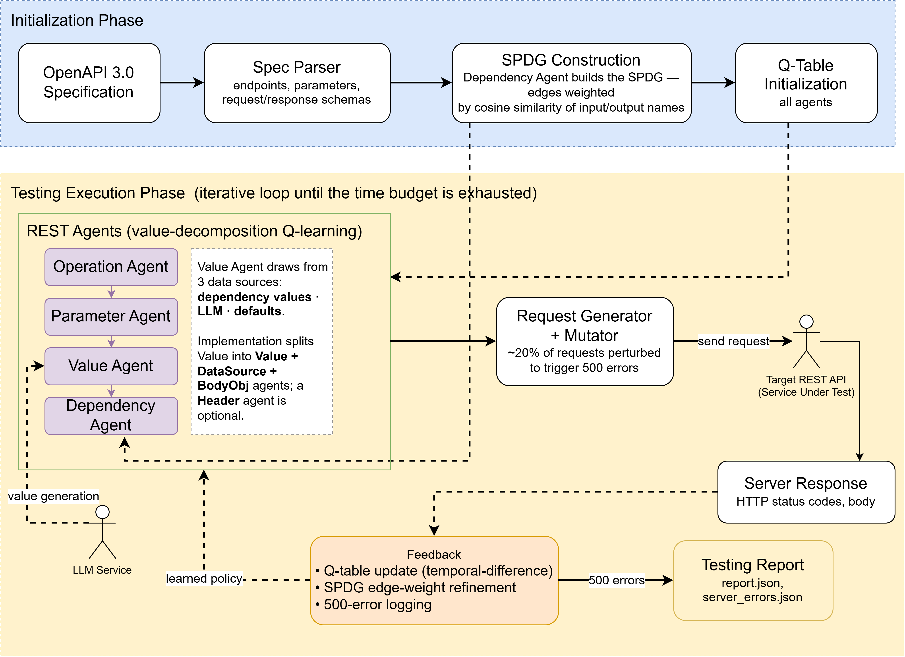

# AutoRestTest

**AI-powered automated REST API testing.**

Give AutoRestTest your API's OpenAPI spec — or just upload your source code
and let it write one for you — and it does the rest: it learns how your
endpoints depend on each other, then uses reinforcement-learning agents
backed by an LLM to actually exercise your API. Not random fuzzing — it
chains calls the way a real client would (register, then log in, then use the
ID it just got back), while mutating values to probe edge cases, and reports
back exactly what broke and why.

**🔗 Live app:** https://autoresttest.vercel.app


---

## What it does

- **Generate a spec from your source code.** No OpenAPI spec yet? Upload a
  zip of your API's codebase and AutoRestTest reads it with an LLM pipeline
  and writes one for you. You review the result before it's ever applied to
  your project — nothing is overwritten silently.

- **AI-driven test generation.** A multi-agent reinforcement-learning engine
  explores your API's operations, learning which sequences of calls actually
  work and which parameter values and payloads trigger real bugs — rather
  than firing requests at random.

- **See how your API is connected.** A dependency graph visualizes which
  operations feed into which (e.g. "the ID from `POST /orders` is used by
  `GET /orders/{id}`"), both as a static map derived from the spec and, after
  a run, with the engine's learned confidence values layered on top.

- **Full request/response capture.** Every request the engine sends and
  every response it gets back is recorded, so a failure is fully
  reproducible — not just a status code. Copy any of them as a curl command,
  or re-send one live and see the fresh response inline.

- **Plain-language failure explanations.** An LLM reads a failed
  request/response pair and explains, in plain language, what likely went
  wrong — and can describe what each generated request was testing.

- **Replay a run as a regression check.** Re-send a completed run's exact
  captured requests, in the same order, with no new AI generation — an
  apples-to-apples check on whether a fix actually landed.

- **Built for teams.** Invite teammates to a project with admin, tester, or
  viewer roles, so testing an API doesn't have to be a one-person job.

- **Live-tunable AI settings.** An admin can change which model, provider,
  and rate limits power every AI-driven part of the platform from a settings
  page — no redeploy required.

## Getting started

The fastest way to try it is the live deployment:

1. Open **[autoresttest.vercel.app](https://autoresttest.vercel.app)** and
   register an account.
2. Create a project, then either upload an OpenAPI spec file or generate one
   from your API's source code.
3. Start a test run — give it your API's live base URL and a time budget.
4. Watch results come in: coverage, status codes, server errors, and every
   request the engine made. Open the dependency graph to see how it explored
   your API, and ask for a plain-language explanation of anything that
   failed.

Step-by-step walkthroughs of every screen are in the
**[User Guide](docs/USER_GUIDE.md)**.

## Documentation

| Document | What's in it |
|----------|--------------|
| **[User Guide](docs/USER_GUIDE.md)** | Every page and feature, in the order a new user meets them |
| **[API Reference](docs/API.md)** | All 58 backend routes — payloads, responses, roles, error codes |
| **[Test Report](docs/TEST_REPORT.md)** | 87 test cases across 16 functional modules |
| **[RUNNING.md](RUNNING.md)** | Local setup, mock vs. real engine modes, production deployment |
| **[CLAUDE.md](CLAUDE.md)** | Architecture and conventions across the monorepo |
| [backend/README](backend/README.md) · [frontend/README](frontend/README.md) | Per-subproject setup and conventions |
| [autoresttest-core/CLAUDE.md](autoresttest-core/CLAUDE.md) · [OOPS-final/CLAUDE.md](OOPS-final/CLAUDE.md) | Internals of the two Python research tools |

## How it fits together

A **monorepo of five independent subprojects** — each with its own
dependencies, build and lockfile. There is no root-level package manager or
workspace tool: `cd` into a subproject to run anything.

| Subproject | Stack | What it is |
|------------|-------|------------|
| **`frontend/`** | Next.js 16, React 19, Tailwind 4 | The web client |
| **`backend/`** | NestJS 11, Prisma 7, PostgreSQL | Application server — auth, projects, specs, runs, reports, collaboration |
| **`engine-service/`** | Flask + waitress, Python | Wraps both Python tools behind an async-job HTTP API, and records engine traffic through a reverse proxy |
| **`autoresttest-core/`** | Python 3.10, Poetry | The testing engine: spec parsing, dependency graph, MARL/Q-learning request generation |
| **`OOPS-final/`** | Python 3.12 | Vendored research tool — reads source code and writes an OpenAPI spec. **Never modified** |

The two Python tools run on different Python versions, which is why
`engine-service` invokes each through its own virtual environment rather than
importing them.

### A test run, end to end

```
Browser ──▶ backend (NestJS) ──▶ engine-service (Flask) ──▶ autoresttest-core
                  │                       │                        │
                  │                       │   1. parse the OpenAPI spec
                  │                       │   2. build the dependency graph
                  │                       │   3. initialise Q-tables (LLM)
                  │                       │   4. generate + send requests ──▶ your API
                  │                       │
                  │              ◀─────────  results + captured traffic
                  ▼
            PostgreSQL  ──▶  report, graph, every request/response
```

The backend returns immediately and polls the job in the background; the
browser polls the backend every three seconds. Nothing blocks on a run that
may take an hour.

> **A run takes far longer than its time budget, by design.** The budget
> bounds only phase 4. Building the graph and initialising the Q-tables cost
> two LLM calls per operation and are deliberately not time-bounded — see
> [CLAUDE.md](CLAUDE.md) for how caching and parallelism keep that in hand.

### Generating a spec from source code



Spec generation has its own queue, its own worker thread and its own LLM
credentials, separate from test runs — a multi-hour generation must not block
them. The generated document is parked for review and only becomes the
project's spec when the user explicitly applies it.

## Developing or self-hosting

See **[RUNNING.md](RUNNING.md)** for the full setup. The short version:

```bash
# engine-service
cd engine-service && python -m venv .venv
.venv/Scripts/pip install -r requirements.txt
.venv/Scripts/python wsgi.py                    # :5000

# backend
cd backend && npm install && npx prisma migrate dev
npm run start:dev                               # :3000

# frontend
cd frontend && npm install && npm run dev       # :3001
```

Set **`ENGINE_MODE=mock`** in `engine-service/.env` to exercise both job types
offline in seconds — no LLM key, no engine run, no spec generation. This is
the fast loop for anything touching the backend or frontend.

---

Research basis: *AutoRestTest* (ICSE 2025) — see `resources/paper/`.
`autoresttest-core/` and `OOPS-final/` are research tools vendored into this
repository; the backend and frontend wrap them into a collaborative product.
