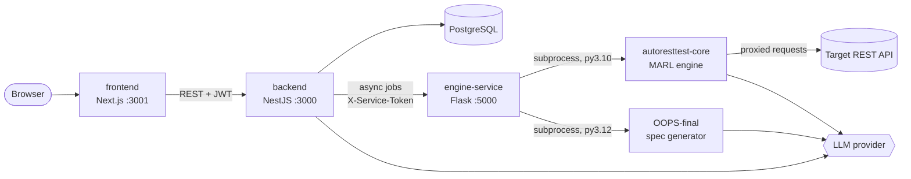

<div align="center">

# AutoRestTest

**An AI-Powered Platform for Automated REST API Testing**

[](https://autoresttest.vercel.app)


[Live app](https://autoresttest.vercel.app) · [Demo](#demo) · [Quick start](#quick-start) · [Self-host](#self-hosting-with-docker) · [Documentation](#documentation)

</div>

---

## Demo


https://github.com/user-attachments/assets/60480f30-fcc8-462f-8d5e-b3e9c55a5866


## Contents

- [AutoRestTest](#autoresttest)
  - [Demo](#demo)
  - [Contents](#contents)
  - [Overview](#overview)
  - [Key features](#key-features)
  - [Screenshots](#screenshots)
  - [How it works](#how-it-works)
    - [Testing engine](#testing-engine)
    - [Spec generation from source code](#spec-generation-from-source-code)
    - [Research background](#research-background)
  - [Architecture](#architecture)
  - [Quick start](#quick-start)
    - [Hosted](#hosted)
  - [Self-hosting with Docker](#self-hosting-with-docker)
  - [Run from source](#run-from-source)
  - [Configuration](#configuration)
  - [Using the platform](#using-the-platform)
  - [Project structure](#project-structure)
  - [Documentation](#documentation)
  - [Testing and quality](#testing-and-quality)

## Overview

REST APIs are hard to test well. Their input spaces are large, their operations depend on one another (the ID returned by `POST /orders` feeds `GET /orders/{id}`), and a useful test needs a *valid sequence* of requests, not just one. Manual tests are slow and do not scale, and random fuzzing misses the dependencies.

AutoRestTest is a collaborative web platform that automates this end to end. It combines three ideas:

- **Semantic Property Dependency Graph (SPDG).** A graph built from your OpenAPI spec shows which operations produce values that others consume.
- **Multi-agent reinforcement learning (MARL).** Seven cooperating Q-learning agents learn which operations, parameters, values and payloads lead to successful calls and real bugs.
- **Large language models.** An LLM generates realistic parameter values, explains failures in plain language, and can even write the OpenAPI spec from your source code.

You upload a spec (or generate one), point the engine at a live API with a time budget, and get coverage, status-code analytics, every captured request and response, and an explanation of each server error.

## Key features

| Area | What you get |
|---|---|
| **Specification** | Upload OpenAPI 3.x (JSON/YAML), or **generate one from a zip of your source code**. Generated specs are held for review and never applied silently. Framework presets speed up generation. |
| **Test generation** | A MARL engine learns productive call sequences and mutates a share of requests (wrong types, boundary values, dropped auth, and more) to trigger server errors. Save, re-run and compare runs. |
| **Insight** | Interactive dependency graph (static, and with learned confidence after a run). Every request and response is captured, with **Copy as curl** and **live re-send**. |
| **AI explanations** | Plain-language explanation of each failed request, and a one-sentence description of what every generated request was testing. |
| **Regression checks** | **Replay** a run's exact captured requests in the same order, with no new generation, to confirm that a fix landed. A run history panel compares the original with its replays. |
| **Reports** | Coverage, status-code distribution, per-endpoint results, **CSV and PDF export**. |
| **Teams** | Invite teammates as Admin, Tester or Viewer. Role checks are enforced on the server. Optional email notifications. |
| **Administration** | Change the LLM model, provider and rate limits for each AI feature from a settings page, with no redeploy. |

## Screenshots

<details>
<summary><strong>Authentication & Dashboard</strong></summary>

| Landing Page | Register | Login |
|:---:|:---:|:---:|
|  |  |  |
| **Email Verification** | **Dashboard** | **Project Overview** |
|  |  |  |

</details>

<details>
<summary><strong>API setup and Graph</strong></summary>

| API Spec | Generate Spec (AI) | Dependency Graph |
|:---:|:---:|:---:|
|  |  |  |
| **Endpoints** | **Add Endpoint** | **Create Project** |
|  |  |  |

</details>

<details>
<summary><strong>Testing and Results</strong></summary>

| Create Test Suite | Test Results | Request Logs |
|:---:|:---:|:---:|
|  |  |  |

</details>

<details>
<summary><strong>Team & Settings</strong></summary>

| Team Management | Invite Member | My Invitations |
|:---:|:---:|:---:|
|  |  |  |
| **Profile Settings** | **Password Reset (1)** | **Password Reset (2)** |
|  |  |  |

</details>

## How it works

### Testing engine

The engine (`autoresttest-core`) runs in two phases.

1. **Initialization.** It parses the OpenAPI 3.0 spec, builds the SPDG (edges are weighted by the cosine similarity of input and output property names), and initializes the Q-tables of all agents. This phase calls the LLM for realistic values and is **not** covered by the time budget.
2. **Testing execution.** Until the time budget is spent, the agents pick an operation, a parameter combination, values and dependency sources. The request generator builds the call, and a mutator perturbs a share of requests (`mutation_rate`, default 0.2). The target API's response updates the Q-tables and refines the SPDG, and 5xx errors are recorded for the report.

<p align="center">
  
</p>

The seven agents are Operation, Parameter, Value, Body-object, Data-source and Dependency, plus an opt-in Header agent.

### Spec generation from source code

The OOPS pipeline (`OOPS-final`) reads a zipped codebase with an LLM and produces an OpenAPI document. Generation runs as a background job and the result is staged for your review. You decide whether to apply it.

<p align="center">
  
</p>

### Research background

- *A Multi-Agent Approach for REST API Testing with Semantic Graphs and LLM-Driven Inputs*, ICSE 2025: [arXiv:2411.07098](https://arxiv.org/abs/2411.07098v2). The basis of the testing engine.
- *OOPS: Automated generation of REST API specification via LLMs*: [arXiv:2601.12735](https://arxiv.org/abs/2601.12735). The basis of spec generation.

## Architecture

A monorepo of **five independent subprojects**. Each has its own dependencies, build and lockfile, and there is no root-level package manager. `cd` into a subproject to run anything.


```mermaid
flowchart LR
    U([Browser]) --> FE["frontend<br/>Next.js :3001"]
    FE -->|REST + JWT| BE["backend<br/>NestJS :3000"]
    BE --> DB[(PostgreSQL)]
    BE -->|async jobs<br/>X-Service-Token| ES["engine-service<br/>Flask :5000"]
    ES -->|subprocess, py3.10| CORE["autoresttest-core<br/>MARL engine"]
    ES -->|subprocess, py3.12| OOPS["OOPS-final<br/>spec generator"]
    CORE -->|proxied requests| API[(Target REST API)]
    CORE --> LLM{{LLM provider}}
    OOPS --> LLM
    BE --> LLM
```

| Subproject | Stack | Role |
|---|---|---|
| [`frontend/`](frontend) | Next.js 16, React 19, Tailwind 4, TanStack Query | Web client, port **3001** |
| [`backend/`](backend) | NestJS 11, Prisma 7, PostgreSQL, JWT, Resend | Application server, port **3000**: auth, projects, specs, runs, reports, collaboration (58 routes, 14 models) |
| [`engine-service/`](engine-service) | Flask + waitress, Python | Wraps both Python tools behind an async-job HTTP API and records engine traffic through a reverse proxy, port **5000** |
| [`autoresttest-core/`](autoresttest-core) | Python 3.10, Poetry | The testing engine: spec parsing, SPDG, MARL/Q-learning |
| [`OOPS-final/`](OOPS-final) | Python 3.12+, uv | Vendored research tool that writes an OpenAPI spec from source code. **Never modified** |

The two Python tools need incompatible interpreters (3.10 and 3.12+), which is why `engine-service` runs each through its own virtual environment instead of importing it.

**Where data lives.** PostgreSQL holds users, projects, specs, endpoints, runs and captured requests. Engine caches (graphs and Q-tables, keyed by `spec_<sha256>`), per-job logs under `engine-service/jobs/<id>/` and raw engine output under `autoresttest-core/data/` live on the engine host's filesystem.

## Quick start

| Path | Best for | Go to |
|---|---|---|
| **Hosted** | Trying it in a minute, with nothing to install | [below](#hosted) |
| **Docker** | Running on your own infrastructure with your own LLM keys | [Self-hosting with Docker](#self-hosting-with-docker) |
| **From source** | Developing or modifying the platform | [Run from source](#run-from-source) |

### Hosted

1. Open **[autoresttest.vercel.app](https://autoresttest.vercel.app)** and register. A six-digit code is emailed to confirm your address.
2. Create a project, then upload an OpenAPI spec or generate one from your source code.
3. Create a run with your API's live base URL and a time budget, then start it.
4. Watch results arrive. Open the dependency graph, inspect captured requests, and ask for an explanation of any failure.

Step-by-step walkthroughs of every screen are in the **[User Guide](docs/USER_GUIDE.md)**.

## Self-hosting with Docker

Run the whole platform on your own infrastructure so that your APIs and your LLM keys never leave your network.

**Prerequisites:** Docker with Compose v2 (`docker compose`). Free host ports **3000**, **3001**, **5000** and **5432**.

**1. Get the files.** Clone the repository, or download `docker-compose.prod.yml` and `docker-compose.env.example`.

```bash
git clone https://github.com/CodeWithIsmail/AutoRestTest.git
cd AutoRestTest
```

**2. Configure.** Copy the example to `.env` next to the compose file and edit it.

```bash
cp docker-compose.env.example .env      # Windows PowerShell: Copy-Item docker-compose.env.example .env
```

| Variable | What to set |
|---|---|
| `ADMIN_EMAILS` | Comma-separated emails allowed to open the LLM settings page |
| `JWT_SECRET` | A long random string (`openssl rand -base64 48`) |
| `SHARED_INTERNAL_TOKEN` | A random string shared by the backend and the engine |
| `POSTGRES_PASSWORD` | A strong database password |

> [!WARNING]
> The example file ships with well-known placeholder secrets. **Change `JWT_SECRET`, `SHARED_INTERNAL_TOKEN` and `POSTGRES_PASSWORD` before exposing the stack to anyone.**

**3. Start.**

```bash
docker compose -f docker-compose.prod.yml up -d
```

**4. First-run checklist.**

1. Open **http://localhost:3001** and register with an email from `ADMIN_EMAILS`.
2. Registration needs a six-digit code. In this setup email is in mock mode, so the code is printed in the backend log:
   ```bash
   docker compose -f docker-compose.prod.yml logs backend
   ```
3. Sign in and open **Admin, LLM Settings** (`/admin/llm-settings`). **LLM keys are empty by default**, so set the provider key, model and base URL for each scope: `TEST_ENGINE` (test runs), `SPEC_GENERATION` (spec from source) and `REPORT_EXPLANATION` (failure and request explanations). Changes apply live.

**Managing the stack**

```bash
docker compose -f docker-compose.prod.yml logs -f      # follow logs
docker compose -f docker-compose.prod.yml down         # stop, keep data
docker compose -f docker-compose.prod.yml down -v      # stop AND delete the database volume
```

| Service | Port | Image |
|---|--:|---|
| frontend | 3001 | `codewithismail/autoresttest-frontend` |
| backend | 3000 | `codewithismail/autoresttest-backend` |
| testing-engine | 5000 | `codewithismail/autoresttest-engine` |
| database | 5432 | `postgres:15` |

To build the images from source instead, use `docker-compose.yml` with `docker compose up -d --build`.

## Run from source

Full details, mock vs. real mode, and troubleshooting are in **[RUNNING.md](RUNNING.md)**. The short version:

**Prerequisites:** Node.js 20.9+, Python 3.11 (engine-service), 3.10 (autoresttest-core) and 3.12+ (OOPS-final), [Poetry](https://python-poetry.org/), [uv](https://docs.astral.sh/uv/), PostgreSQL, and optionally a JRE 17+ on `PATH` (spec generation falls back to lower-fidelity conversion without it).

```bash
# 1. engine and its two tools (once)
cd autoresttest-core && poetry install && cd ..
cd OOPS-final && uv sync && cd ..
cd engine-service && python -m venv .venv
.venv/bin/pip install -r requirements.txt        # Windows: .venv\Scripts\pip
cp .env.example .env && cd ..

# 2. backend (once): set DATABASE_URL and JWT_SECRET in backend/.env
cd backend && npm install && cp .env.example .env
npx prisma migrate deploy && npx prisma generate && cd ..

# 3. frontend (once)
cd frontend && npm install
echo "NEXT_PUBLIC_API_BASE_URL=http://localhost:3000" > .env.local && cd ..
```

Then start the three services, in order, each in its own terminal:

```bash
cd engine-service && .venv/bin/python wsgi.py    # :5000  (Windows: .venv\Scripts\python)
cd backend && npm run start:dev                  # :3000
cd frontend && npm run dev                       # :3001
```

On Windows, `.\start-dev.ps1` opens all three in order (`-SkipEngine` runs only the backend and frontend, `-GenerateOnly` only writes the launch scripts).

> [!TIP]
> Set `ENGINE_MODE=mock` in `engine-service/.env` to run both job types offline in seconds, with no LLM key, no engine run and no spec generation. The backend defaults to `LLM_MODE=mock` and `EMAIL_MODE=mock`, which prints verification codes to its console. This is the fast loop for any backend or frontend work.

## Configuration

The `.env.example` files are the authoritative lists. These are the settings that matter most.

| Service | Variable | Purpose |
|---|---|---|
| backend | `DATABASE_URL` | PostgreSQL connection string |
| backend | `JWT_SECRET` | Signs access tokens |
| backend | `CORS_ORIGIN` | Allowed browser origin(s), e.g. `http://localhost:3001` |
| backend | `ENGINE_SERVICE_URL` | Engine address. Use `127.0.0.1`, not `localhost` |
| backend | `ENGINE_SERVICE_TOKEN` | Must equal engine-service `SERVICE_TOKEN` |
| backend | `ADMIN_EMAILS` | Who may open `/admin/llm-settings` |
| backend | `LLM_MODE`, `EMAIL_MODE` | `mock` (default, offline) or `real` |
| backend | `RESEND_API_KEY`, `EMAIL_FROM` | Transactional email, real mode only |
| backend | `REQUIRE_EMAIL_VERIFICATION` | Set `false` to skip the signup code |
| engine-service | `ENGINE_MODE` | `mock` or `real` |
| engine-service | `SERVICE_TOKEN` | Shared secret the backend sends as `X-Service-Token` |
| engine-service | `API_KEY`, `LLM_API_BASE`, `LLM_ENGINE` | Fallback LLM for test runs (admin settings override them) |
| engine-service | `OOPS_API_KEY`, `OOPS_LLM_API_URL`, `OOPS_MODEL` | Separate LLM credentials for spec generation |
| engine-service | `ENGINE_USE_CACHE`, `ENGINE_VALUE_WORKERS` | Reuse graph and Q-tables for the same spec, and value-generation parallelism |
| frontend | `NEXT_PUBLIC_API_BASE_URL` | Backend base URL |

`SERVICE_TOKEN` and `ENGINE_SERVICE_TOKEN` must be byte-identical or the backend cannot reach the engine.

## Using the platform

1. **Create a project.** You become its owner.
2. **Add a spec.** Upload an OpenAPI file, or generate one from a source zip (up to 50 MB), review it, then apply it.
3. **Review endpoints and the dependency graph.** Build the graph from the Dependencies tab (it reads only the spec and sends no requests).
4. **Run tests.** Create a run with the target URL, a time budget, an optional mutation rate and optional custom headers (such as `Authorization`), then start it.
5. **Inspect results.** Check coverage and status codes, open captured requests, ask for AI explanations, export CSV or PDF, and replay the run after a fix.

**Reading results.** A **2xx** is a success. A **4xx** means the API correctly rejected an invalid request, which is *not* a failure. A **5xx** means the API failed to handle a request, and it is the only response counted as a fault.

| Role | Can do |
|---|---|
| **Owner** | Everything, plus rename or delete the project and manage all members |
| **Admin** | Manage the spec, endpoints, runs, graph, team and invitations |
| **Tester** | Configure, run and replay tests, describe requests, build the graph. Cannot change the spec, endpoints or team |
| **Viewer** | Read-only |

## Project structure

```text
AutoRestTest/
├── frontend/            Next.js web client
├── backend/             NestJS API: prisma/ schema and migrations, src/ feature modules
├── engine-service/      Flask job service wrapping the Python tools, with tests/
├── autoresttest-core/   MARL testing engine (Poetry)
├── OOPS-final/          Vendored spec-from-source generator (uv), never modified
├── docs/                User guide, API reference, test report, OpenAPI specs
├── resources/           Screenshots, diagrams, papers and the technical report
├── scripts/             Per-service launch scripts generated by start-dev.ps1
├── Dockerfile           Engine-service image (core + OOPS + JRE)
├── docker-compose.yml        Build and run from source
├── docker-compose.prod.yml   Run prebuilt images
├── RUNNING.md           Full setup, modes, deployment and troubleshooting
└── CLAUDE.md            Architecture and conventions notes for contributors and AI agents
```

## Documentation

| Document | What's in it |
|---|---|
| **[User Guide](docs/USER_GUIDE.md)** | Every page and feature, in the order a new user meets them |
| **[API Reference](docs/API.md)** | All 58 backend routes: payloads, responses, roles, error codes |
| **[OpenAPI spec](docs/openapi/)** | Machine-readable description of those routes, in YAML and JSON |
| **[Test Report](docs/TEST_REPORT.md)** | 87 black-box test cases across 16 functional modules |
| **[RUNNING.md](RUNNING.md)** | Local setup, mock vs. real engine modes, production deployment |
| **[Technical Report](resources/SRS/SPL3%20Technical%20Report%20-%20BSSE%201433.pdf)** ([DOCX](resources/SRS/SPL3%20Technical%20Report%20-%20BSSE%201433.docx), [Markdown](resources/SRS/SPL3%20Technical%20Report%20-%20BSSE%201433.md)) | Requirements, database and component design, testing, evaluation and user manual |
| **[CLAUDE.md](CLAUDE.md)** | Architecture and conventions across the monorepo |
| Subproject READMEs | [backend](backend/README.md) · [frontend](frontend/README.md) · [engine-service](engine-service/README.md) · [autoresttest-core](autoresttest-core/README.md) · [OOPS-final](OOPS-final/readme.md) |

## Testing and quality

- **257 backend unit tests** in 21 Jest suites, covering business logic, role checks, graph merging, report export and the engine client. External services are mocked.
- **87 black-box test cases** across 16 modules, all passing (see the [Test Report](docs/TEST_REPORT.md)).

```bash
cd backend && npm test                                  # unit tests
cd backend && npm run lint && npm run build
cd engine-service && .venv/bin/python -m pytest -q      # runs in mock mode (Windows: .venv\Scripts\python)
cd frontend && npx tsc --noEmit && npm run lint && npm run build
```

