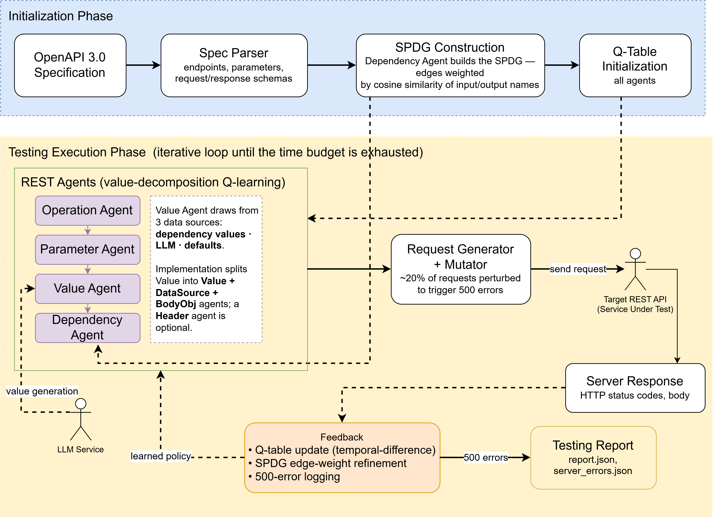

# AutoRestTest: An AI-Powered Platform for Automated REST API Testing

AutoRestTest bridges the gap in REST API testing by transforming manual, fragmented
test creation into an intelligent, fully automated process. By integrating Multi-Agent
Reinforcement Learning, a Semantic Property Dependency Graph, and Large Language
Models, the platform efficiently navigates complex, interdependent API operations.
Beyond simple test execution, the system actively accelerates debugging by providing
plain-language, AI-generated explanations whenever it uncovers hidden server-side
faults. Built as a collaborative SaaS platform, it allows teams to securely manage
specifications, run customized test suites, and track historical results.
Ultimately, AutoRestTest empowers developers to maximize fault detection with minimal
manual effort, ensuring highly reliable web services

# 🔗 Live app: https://autoresttest.vercel.app

## Demo
https://github.com/user-attachments/assets/5994a914-5f1f-4b07-8415-3331acd74687

## What it does

- **Generate a spec from your source code.** No OpenAPI spec yet? Upload a
  zip of your API's codebase and AutoRestTest reads it with an LLM pipeline
  and writes one for you. You review the result before it's ever applied to
  your project — nothing is overwritten silently.

- **AI-driven test generation.** A multi-agent reinforcement-learning engine
  explores your API's operations, learning which sequences of calls actually
  work and which parameter values and payloads trigger real bugs — rather
  than firing requests at random.

- **See how your API is connected.** A dependency graph visualizes which
  operations feed into which (e.g. "the ID from `POST /orders` is used by
  `GET /orders/{id}`"), both as a static map derived from the spec and, after
  a run, with the engine's learned confidence values layered on top.

- **Full request/response capture.** Every request the engine sends and
  every response it gets back is recorded, so a failure is fully
  reproducible — not just a status code. Copy any of them as a curl command,
  or re-send one live and see the fresh response inline.

- **Plain-language failure explanations.** An LLM reads a failed
  request/response pair and explains, in plain language, what likely went
  wrong — and can describe what each generated request was testing.

- **Replay a run as a regression check.** Re-send a completed run's exact
  captured requests, in the same order, with no new AI generation — an
  apples-to-apples check on whether a fix actually landed.

- **Built for teams.** Invite teammates to a project with admin, tester, or
  viewer roles, so testing an API doesn't have to be a one-person job.

- **Live-tunable AI settings.** An admin can change which model, provider,
  and rate limits power every AI-driven part of the platform from a settings
  page — no redeploy required.

## 📸 Platform Screenshots

<details>
<summary><strong>Authentication & Dashboard</strong></summary>

| Landing Page | Register | Login |
|:---:|:---:|:---:|
|  |  |  |
| **Email Verification** | **Dashboard** | **Project Overview** |
|  |  |  |

</details>

<details>
<summary><strong>API Setup & Graph</strong></summary>

| API Spec | Generate Spec (AI) | Dependency Graph |
|:---:|:---:|:---:|
|  |  |  |
| **Endpoints** | **Add Endpoint** | **Create Project** |
|  |  |  |

</details>

<details>
<summary><strong>Testing & Results</strong></summary>

| Create Test Suite | Test Results | Request Logs |
|:---:|:---:|:---:|
|  |  |  |

</details>

<details>
<summary><strong>Team & Settings</strong></summary>

| Team Management | Invite Member | My Invitations |
|:---:|:---:|:---:|
|  |  |  |
| **Profile Settings** | **Password Reset (1)** | **Password Reset (2)** |
|  |  |  |

</details>

## Getting started

The fastest way to try it is the live deployment:

1. Open **[autoresttest.vercel.app](https://autoresttest.vercel.app)** and
   register an account.
2. Create a project, then either upload an OpenAPI spec file or generate one
   from your API's source code.
3. Start a test run — give it your API's live base URL and a time budget.
4. Watch results come in: coverage, status codes, server errors, and every
   request the engine made. Open the dependency graph to see how it explored
   your API, and ask for a plain-language explanation of anything that
   failed.

Step-by-step walkthroughs of every screen are in the
**[User Guide](docs/USER_GUIDE.md)**.

## Documentation

| Document | What's in it |
|----------|--------------|
| **[User Guide](docs/USER_GUIDE.md)** | Every page and feature, in the order a new user meets them |
| **[API Reference](docs/API.md)** | All 58 backend routes — payloads, responses, roles, error codes |
| **[Test Report](docs/TEST_REPORT.md)** | 87 test cases across 16 functional modules |
| **[OpenAPI spec](docs/openapi/)** | Machine-readable description of all 58 routes, in YAML and JSON |
| **[RUNNING.md](RUNNING.md)** | Local setup, mock vs. real engine modes, production deployment |
| [backend/README](backend/README.md) · [frontend/README](frontend/README.md) | Per-subproject setup and conventions |

## How it fits together

A **monorepo of five independent subprojects** — each with its own
dependencies, build and lockfile. There is no root-level package manager or
workspace tool: `cd` into a subproject to run anything.

| Subproject | Stack | What it is |
|------------|-------|------------|
| **`frontend/`** | Next.js 16, React 19, Tailwind 4 | The web client |
| **`backend/`** | NestJS 11, Prisma 7, PostgreSQL | Application server — auth, projects, specs, runs, reports, collaboration |
| **`engine-service/`** | Flask + waitress, Python | Wraps both Python tools behind an async-job HTTP API, and records engine traffic through a reverse proxy |
| **`autoresttest-core/`** | Python 3.10, Poetry | The testing engine: spec parsing, dependency graph, MARL/Q-learning request generation |
| **`OOPS-final/`** | Python 3.12 | Vendored research tool — reads source code and writes an OpenAPI spec. **Never modified** |

The two Python tools run on different Python versions, which is why
`engine-service` invokes each through its own virtual environment rather than
importing them.

## Self-Hosting (Docker)

The easiest way to run the entire AutoRestTest platform on your own infrastructure is using our pre-built Docker images. This allows you to securely test your internal APIs and use your own LLM API keys without your data ever leaving your network.

**1. Get the configuration files**
Download `docker-compose.prod.yml` and `docker-compose.env.example` from this repository. (Alternatively, just clone this repository to your machine).

**2. Set up your environment**
Rename `docker-compose.env.example` to `.env`. 
Open the `.env` file and set your `ADMIN_EMAILS` (this is the account that will have access to configure the LLM API keys in the UI).

**3. Start the platform**
Run the following command to download the pre-built images and start the system:
```bash
docker-compose -f docker-compose.prod.yml up -d
```
Once the startup is complete, open **http://localhost:3001** in your browser and log in with your Admin Email!

## Local Development

If you wish to modify the source code, see **[RUNNING.md](RUNNING.md)** for the full setup. The short version:

```bash
# engine-service
cd engine-service && python -m venv .venv
.venv/Scripts/pip install -r requirements.txt
.venv/Scripts/python wsgi.py                    # :5000

# backend
cd backend && npm install && npx prisma migrate dev
npm run start:dev                               # :3000

# frontend
cd frontend && npm install && npm run dev       # :3001
```

Set **`ENGINE_MODE=mock`** in `engine-service/.env` to exercise both job types
offline in seconds — no LLM key, no engine run, no spec generation. This is
the fast loop for anything touching the backend or frontend.

**How AutoRestTest generates OAS from source code**
---


**How AutoRestTest testing engine works**
---


